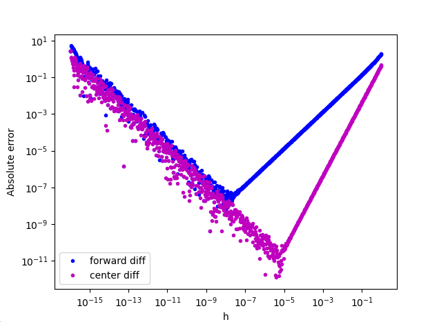
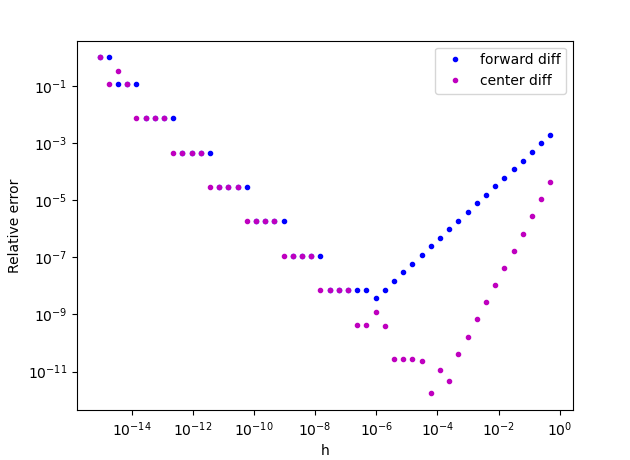

# Derivative Approximation

These two script shows how to perform the forward and center differences to approximate a derivative. A graph of the error commited during the approximation is provided for each script.

## Script 1: Absolute error considering f(x) = exp(x)

## Script 2 Relative error considering f(x) = log(x) + x/2

